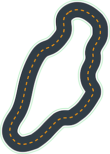

# Aligning DeepRacer Track Geometries with Bayesian Optimization

The AWS DeepRacer Virtual Circuit is run every month and recently the race courses are slight variations of the available training courses.  

The race cource waypoints are not released to developers, which makes it difficult to evaluate logs of the track laps run on that private track.

Because the Training Track and Race Track are ~70% similar, and both are available as SVG, we can fit them together and generate a NumPy array for use in jupyter notebooks for analysis.  I was able to achieve a pretty good result by hand, but it wasn't quite right. To improve this I used [Bayesian Optimization](https://en.wikipedia.org/wiki/Bayesian_optimization) to generate a good estimate of the Race Track NumPy oordinates.

## Source and Results

| Training Track SVG | NumPy coordinates (provided) |
|----------------|-------------------|
|  | [Canada_Training.npy](tracks/Canada_Training.npy) |


| Race Track SVG | NumPy coordinates (Bayes generated)|
|-------|-------------------|
|  | [canada_race.npy](tracks/canada_race.npy) |

## Method

The tools I used are:

- [fmfn/BayesianOptimization](https://github.com/fmfn/BayesianOptimization)
- [Shapely](https://shapely.readthedocs.io)
- [mathandy/svgpathtools](https://github.com/mathandy/svgpathtools)
- [NumPy](https://numpy.org)
- [Jupyter](https://jupyter.org)

### Goal: function to optimize

The function I wanted to optimize was the "fit" of the Race Track onto the Training Track. So the function is of the form:

```
f(scale, rotate, translate)
```

I found that the optimization runs much faster and results are more accurate if I narrowed the search boundaries.  So I used the expected track length from the log files to find the exact scale and reduce the function to optimize down to:

```
f(rotate, translate)
```


### Inputs: Starting Geometries

The optimization process started with Shapely geometrics,

**Training Track:** NumPy to Shapely LineString:


**Race Track:** SVG Path to NumPy array to Shapely LineString:


### Prepare for Optimization

1) Scale first since we know the desired centerline length:

```python
from shapely import affinity

scale_factor = DESIRED_LENGTH / ls_source_center_line.length
ls_source_center_line = affinity.scale(ls_source_center_line, xfact=scale_factor, yfact=scale_factor)
```

2) Align the shapes so they are overlapped, reducing the translation search space:

```python
target_center = Polygon(ls_source_center_line).centroid
source_center = Polygon(ls_target_center_line).centroid
p_source = affinity.translate(p_source, 
                              xoff=(target_center.x - source_center.x),
                              yoff=(target_center.y - source_center.y))

```

3) Set the bounds of optimization search:

```python
minx, miny, maxx, maxy = p_target.bounds
mintx = minx - target_center.x
maxtx = maxx - target_center.x
minty = miny - target_center.y
maxty = maxy - target_center.y
pbounds = {
    'r': (-180,180),      # degree of rotation
    'x': (mintx, maxtx),  # centroid definitely won't move outside of target bounds
    'y': (minty, maxty)
}
```


### Iterate

The function passed to the optimizer is

```python
def coincident_area(r,x,y):
    global p_source
    global p_target
    p_source_t = affinity.translate(p_source, xoff=x, yoff=y)
    p_source_r = affinity.rotate(p_source_t, r, origin='centroid')
    intersection = p_source_r.intersection(p_target)
    difference = p_source_r.difference(p_target)
    return intersection.area - 20*difference.area # penalize overhang so optimization doesn't find some odd orientation that has largest overlap
```

I tried a few different functions and this one worked the best. 


### Result

The [canada_race.npy](tracks/canada_race.npy) file has the generated output, after converting the final shape to a NumPy array and save it.


